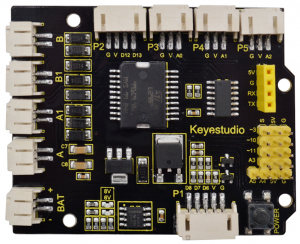
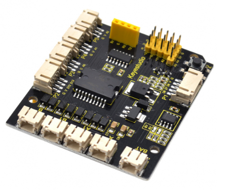
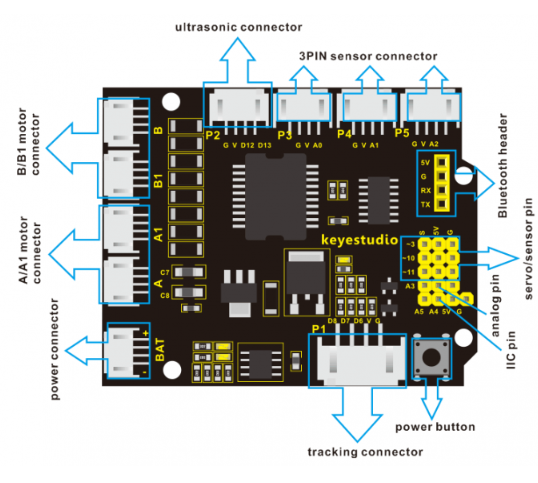
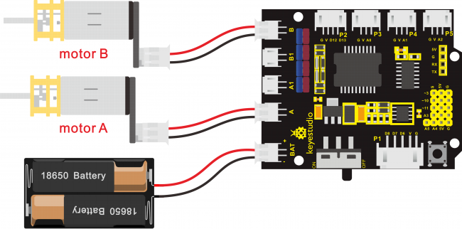
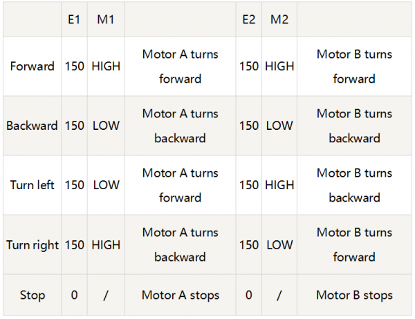
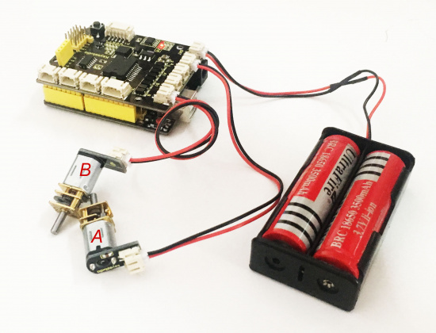

# KS0298 Keyestudio quick connectors Motor Drive Shield



## 1. Overview

There are many ways to drive the motor. Our robot uses the most commonly used L298P solution.

L298P is an excellent high-power motor driver IC produced by STMicroelectronics. It can directly drive DC motors, two-phase and four-phase stepping motors. The driving current up to 2A, and output terminal of motor adopts eight high-speed Schottky diodes as protection.

We have designed the motor driver shield based on the L298P circuit.The stackable design can make it be plugged directly into the Arduino, reducing the technical difficulty of using and driving the motor.

Direct stack the motor driver shield onto UNO R3 board, after the BAT is powered on, press the **POWER button**, to supply the power for both keyestudio motor driver shield and UNO R3 board.

For simple wiring, the motor driver shield comes with **anti-reverse PH2.0-(2P/3P/4P/ 5P) interfaces**. When connecting the motor, power supply and sensor modules, you just need to plug in directly.


The Bluetooth interface on the motor driver shield is fully compatible with keyestudio Bluetooth module. When connecting, just plug Bluetooth module into the corresponding interface.

At the same time, the motor drive shield has brought out extra digital and analog ports in **2.54mm pin headers**, so that you can continue to add other sensors for experiments extension.

The motor drive shield can access to 4 DC motors. The motor connector A and A1, connector B and B1 are separately in parallel, with the same motion law.

The shield comes with 4 fixing holes of 3mm, easy to mount on other devices.



## 2. Technical Details

- Logic part input voltage: DC5V
- Driving part input voltage: DC 7-12V
- Logic part working current: <36mA
- Driving part working current: <2A
- Maximum power dissipation: 25W (T=75℃)
- Working temperature: -25℃～＋130℃
- White connector: PH2.0- (2P/3P/4P/ 5P)
- Pin/female header spacing:2.54mm
- Fixing hole diameter: 3mm

## 3. PINOUT Diagram



## 4. Hookup Guide



## 5. Motor state settings



## 6. Test Code

Code download:   [Resources](./Resources.7z)

```c
int E1 = 9; //  set the speed pin of motor A as D9
int E2 = 5; //  set the speed pin of motor B as D5
int M1 = 2; // set the direction pin of motor A as D2
int M2 = 4; // set the direction pin of motor B as D4
        
void setup(void)
{
  pinMode(M1,OUTPUT); // set M1 as OUTPUT mode
  pinMode(M2,OUTPUT); // set M2 as OUTPUT mode
  pinMode(E1,OUTPUT); //  set E1 as OUTPUT mode
  pinMode(E2,OUTPUT); //  set E2 as OUTPUT mode
}

void advance(void)        // set the forward motion
{
  digitalWrite(M1,HIGH);  // motor A turns forward, the wheel will go forward.
  digitalWrite(M2,HIGH);  // motor B turns forward, the wheel will go forward. 
  analogWrite(E1,150);    // speed of motor A（can be adjusted according to the actual speed of motor. Turn up the value to accelerate, lower the value to decelerate.) 
  analogWrite(E2,150);    // speed of motor B（can be adjusted according to the actual speed of motor. Turn up the value to accelerate, lower the value to decelerate.) 
}  
void back(void)        // set the backward motion
{
 digitalWrite(M1,LOW);   // motor A turns reverse and the wheel will go backward
 digitalWrite(M2, LOW);   //  motor B turns reverse and the wheel will go backward
 analogWrite(E1,150);     //  speed of motor A
 analogWrite(E2, 150);    //  speed of motor B
}  

void turnL(void)     // set the left turn 
{
   digitalWrite(M1,LOW);    // motor A turns reverse and the wheel will go backward 
   digitalWrite(M2, HIGH);  // motor B turns forward and the wheel goes forward, the smart car will turn left.
   analogWrite(E1,150);  // speed of motor A
   analogWrite(E2, 150);  // speed of motor B
}

void turnR(void)            //  set the right turn 
{
   digitalWrite(M1,HIGH);   // motor A turns forward and the wheel will go forward 
   digitalWrite(M2,LOW);    // motor B turns reverse and the wheel goes backward, the smart car will turn right.
   analogWrite(E1,150);     // speed of motor A
   analogWrite(E2, 150);    // speed of motor B
}

void stopp(void)   // set the STOP
{
   digitalWrite(M1,LOW);  // motor A turns reverse
   digitalWrite(M2, LOW);  //  motor B turns reverse
   analogWrite(E1, 0);      //  speed of motor A, speed as zero, means stop
   analogWrite(E2, 0);      // speed of motor B, speed as zero, means stop
}

void loop() 
{ 
    advance();   // go forward
    delay(1000); // delay1S
    back();      //backward
    delay(1000);// delay1S

    turnL();    //turn left
    delay(1000);//delay1S
    turnR();    //turn right  
    delay(1000); //delay1S
    stopp();   // stop
    delay(1000);// delay1S
}
```

## 7. Test Result

Stack well the drive shield onto UNO R3 board, and upload the above code to the board, then press down the POWER button.

The 2 motors simulate the motion of smart car. Go forward for one second, backward for one second, and then turn left for one second, turn right for one second and stop one second, alternately repeating.

